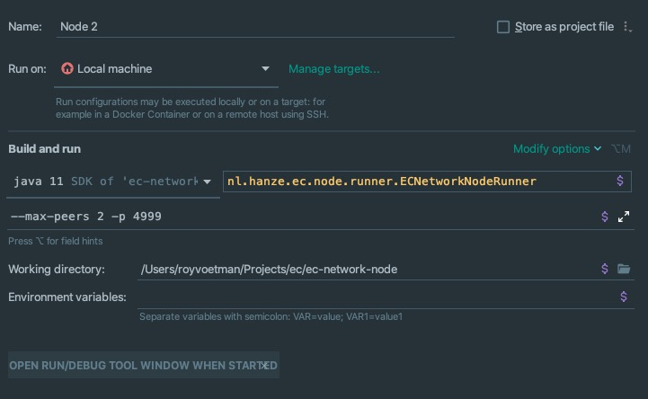
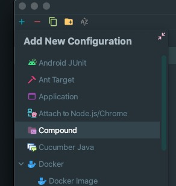
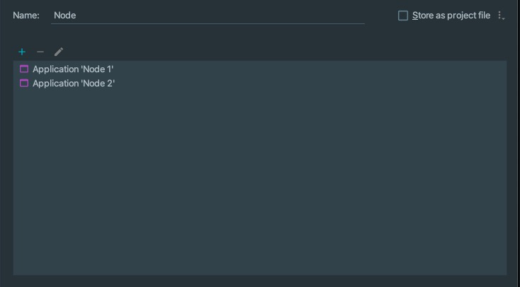

# EC-Network-Node

## Running (IntelliJ)

**Step 1**
After you opened the project in IntelliJ and installed all maven dependencies click on the dropdown in the top right corner and select `Edit Configurations` 


**Step 2**
After selecting `Edit Configurations` a popup window will appear, click on the blue plus icon in the top left corner of the popup and select `Application`


**Step 3**
A form will now appear on the right-hand side of the popup. Fill the form in accordingly, with special emphasis on the CLI argument namely: `--max-peers 1 -p 5000`


**Step 4**
Repeat step 2 & 3 but fill in a different name for the configuration and specify the following CLI argument: `--max-peers 1 -p 4999`



**Step 5**
Again click on the blue plus icon from step 2 but select `Compound` instead of Application.



**Step 6**
Specify the previously defined configurations in the `Compound` form and give the compound configuration a name.



**Step 7**
Lastly click on `Apply` and `OK`, this will save & close the popup. Now the dropdown from step 1 will have an entry that matches the name given to the compound configuration.
When the compound configuration is selected and subsequently the `Green Start Icon` is pressed two Nodes will be started on port `4999` and `5000` accordingly.
 


## Sending commands

**Sending an announcement**
```java
// Add command to peer's command queue such that PeerConnection thread will send it
peerPool.sendBroadcast(new TestAnnouncement())
```

**Sending a request (and waiting for a response)**
```java
// Define command and use WaitForResponse decorator
WaitForResponse cmd = new WaitForResponse(new NeighborsRequest());

// Add command to peer's command queue such that PeerConnection thread will send it
peerPool.sendCommand(peer, cmd)
        
// Let thread wait untill TimeOut or response recieved and the associated worker is finished.
cmd.await();
```

## Receiving commands
Each command class should define a `getWorker` method. The associated worker is a class with a `run` method that is executed when the command is received from another peer.

A worker has access to the `receivedCommand` and `peerCommandQueue`. The `peerCommandQueue` can be used to reply to certain requests for example:

```java
public class NeighborRequestWorker extends Worker {
    public NeighborRequestWorker(Command receivedCommand, BlockingQueue<Command> peerCommandQueue) {
        super(receivedCommand, peerCommandQueue);
    }

    @Override
    public void run() {
        // Define the response to be sent back
        Command rsp = new NeighborsResponse("127.0.0.1", 5002, receivedCommand.getMessageNumber());

        // Add response to peerCommandQueue such that the associated PeerConnection Thread will send it.
        peerCommandQueue.add(rsp);
    }
}
```