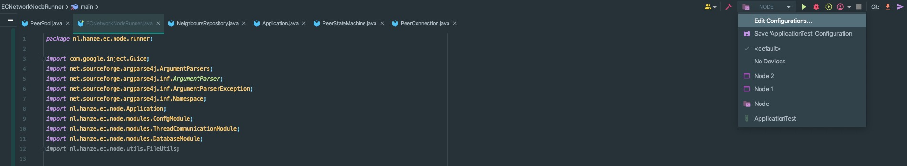
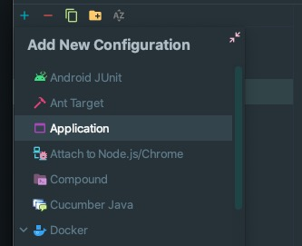
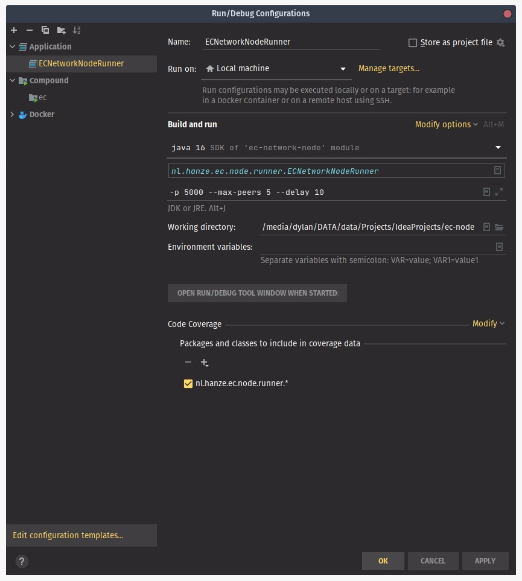
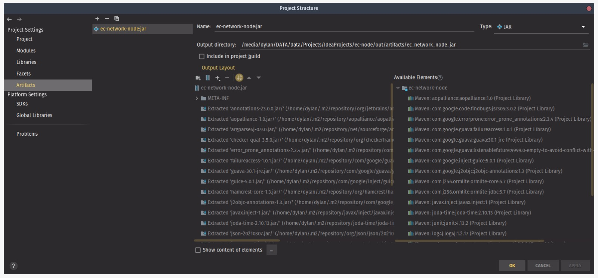
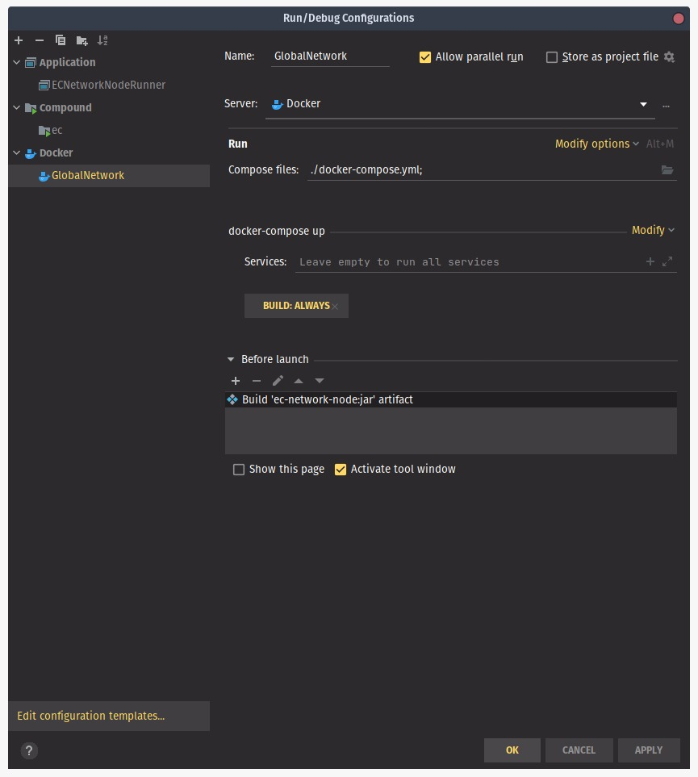
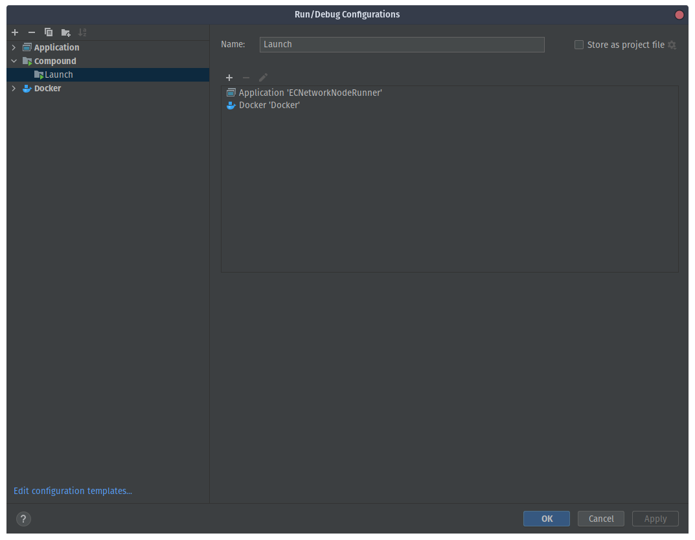

# EC-Network-Node

## Running (IntelliJ)

**Step 1**
After you opened the project in IntelliJ and installed all maven dependencies click on the dropdown in the top right corner and select `Edit Configurations` 



**Step 2**
After selecting `Edit Configurations` a popup window will appear, click on the blue plus icon in the top left corner of the popup and select `Application`



**Step 3**
A form will now appear on the right-hand side of the popup. Fill the form in accordingly and press apply:


**Step 4**
Before adding another configuration for Docker. Create a new JAR (from modules with dependencies) artifact in `File > Project Structure > Artifacts` and press Apply:



**Step 5**
Go back to the configurations and add a Docker Compose configuration:

**Make sure you add the build the JAR artifact before launch and choose to always BUILD**

**Step 6**
For you convenience add a Compound configuration and Apply:



**EXTRA STEP FOR MAC AND WINDOWS**

Install a OpenVPN Client connect using `ENTRY.ovpn`. Without this step you won't be able to connect to the internal 
Docker network.


## Sending commands

**Sending an announcement**
```java
// Add command to peer's command queue such that PeerConnection thread will send it
peerPool.sendBroadcast(new TestAnnouncement())
```

**Sending a request (and waiting for a response)**
```java
// Define command and use WaitForResponse decorator
WaitForResponse cmd = new WaitForResponse(new NeighborsRequest());

// Add command to peer's command queue such that PeerConnection thread will send it
peerPool.sendCommand(peer, cmd)
        
// Let thread wait untill TimeOut or response recieved and the associated worker is finished.
cmd.await();
```

## Receiving commands
Each command class should define a `getWorker` method. The associated worker is a class with a `run` method that is executed when the command is received from another peer.

A worker has access to the `receivedCommand` and `peerCommandQueue`. The `peerCommandQueue` can be used to reply to certain requests for example:

```java
public class NeighborRequestWorker extends Worker {
    public NeighborRequestWorker(Command receivedCommand, BlockingQueue<Command> peerCommandQueue) {
        super(receivedCommand, peerCommandQueue);
    }

    @Override
    public void run() {
        // Define the response to be sent back
        Command rsp = new NeighborsResponse("127.0.0.1", 5002, receivedCommand.getMessageNumber());

        // Add response to peerCommandQueue such that the associated PeerConnection Thread will send it.
        peerCommandQueue.add(rsp);
    }
}
```